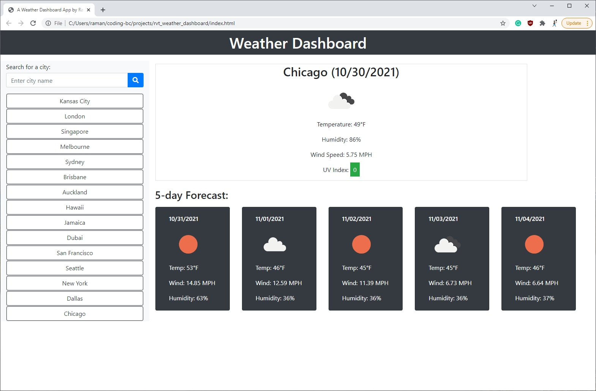

# Weather Dashboard by Raman TV
This application provides the current weather conditions and 5-day forecast for any city in the world. It allows the user to search for any city and displys the weather for that city. The searched cities are saved to local storage as well.

## Screenshot

## Code
* HTML
* CSS (also Bootstrap CSS framework)
* Javascript (also JQuery and Moment javascript libraries)

## APIs used
* [OpenWeather API](https://openweathermap.org/api)

## Deployed Application
* [Weather Dashboard](https://ramantv.github.io/rvt_weather_dashboard/)